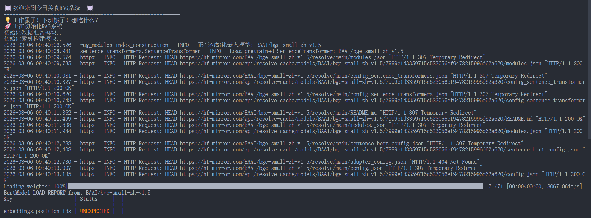
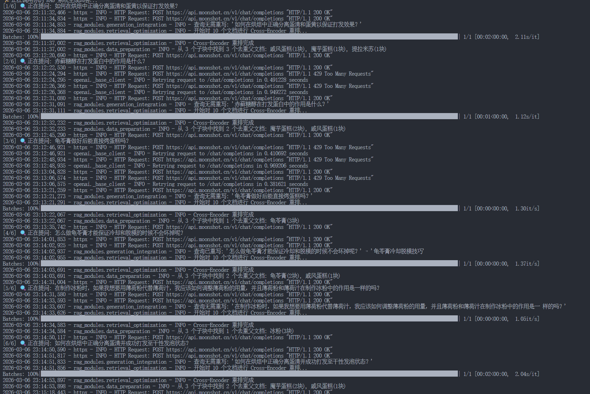
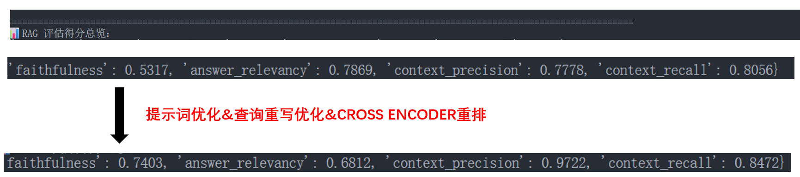

# ASK-RECIPE

## 项目简介
这是一个提供做菜食谱相关问答的项目，主要基于食谱项目[HowToCook](https://github.com/Anduin2017/HowToCook/tree/master)和RAG（检索增强生成）初学者项目[all-in-rag](https://github.com/datawhalechina/all-in-rag/)。

### 项目内容
- 准备数据：基于markdown文档进行结构分块，元数据增强，并构建父子文本块平衡检索准确率和完整性。 
- 构建索引：利用BEG模型对文档做embedding，结合FAISS向量数据库构建和储存索引。
- 优化检索：结合向量检索和BM25检索同时捕捉语义相似度和关键词匹配度，并使用RRF/CROSS EOCODER对检索结果重排。
- 集成生成：使用LLM进行意图识别完成查询路由，分发为列表、详细、一般模式，一般模式下进行查询重写优化。
- 评估系统：使用RAGAS库生成中文测试集并评估。

## 项目意义
本项目是为了记录自己对RAG的全栈技术学习，同时为所有学习RAG的人分享经验。

## 项目亮点
- 系统的搭建了一套RAG，结合了相关理论和实践学习。
- 掌握相关技术栈，如langchain库、BGE模型、FAISS向量数据库。
- 学习了Advanced RAG技术，如父子文本块，向量检索和BM25检索的混合检索，RRF/CROSS EOCODER重排，查询重写和路由。

## 未来计划
- 多模态检索。
- 利用知识图谱构建Graph RAG系统。
- 使用Agentic RAG和强化学习提升RAG系统性能。

## 快速开始
### 环境配置
1. 创建虚拟环境
使用conda创建环境
```bash
conda create -n ask-recipe python=3.12.7
conda activate ask-recipe
```

2. 安装核心依赖
```bash
pip install -r requirements.txt
```

3. 配置API key
在rag_modules文件夹中按照.env.example文件创建一个.env文件，配置其中包括MOONSHOT_API_KEY在内变量。

4. 打开RAG系统进行交互式问答。
```bash
python main.py 
```

...
在“您的问题”后输入食谱相关问题，系统即会根据已准备好的文档回答。
在“是否使用流式输出? (y/n, 默认y):”后选择是否使用流式输出，流式输出可以降低首回答延迟率。

如果想要退出系统，输入“退出”即可。


5. 评估
首先进入评估文件夹中，执行生成测试集脚本基于已有文档生成测试集testset.csv。
```bash
cd evaluation
python generate_testset.py
```

接着回到上一级文件夹下执行评估脚本在生成的测试集下测试。
```bash
cd ..
python evaluate.py
```

即可得到这样的评估结果，每个测试例的评估指标详细结果在eval_report.csv文件中查看，大功告成！




可以看到测试结果的上下文准确度97%和召回率85%较好。

实际上，这是我们进行提示词、查询重写和改用CROSS ENCODER重排优化后的结果，我们先前基于项目[all-in-rag](https://github.com/datawhalechina/all-in-rag/)中的提示词和RRF重排算法只得到了78%的上下准确度和81%的召回率，并且只有53%的忠诚度，幻觉率较高。
值得注意的是，优化前后我们的回答相关性出现了大约十个点的下降，这是什么原因呢？当我们打开eval_report.csv具体查看详细测试例结果时，发现有的问题过于发散在文档中没有找到（生成答案中存在描述），导致LLM开始自己根据经验并杂糅一些文档内容回答，导致出现较高的幻觉率。如果剔除这些问题，反而发现回答的相关性上升了三个点。



